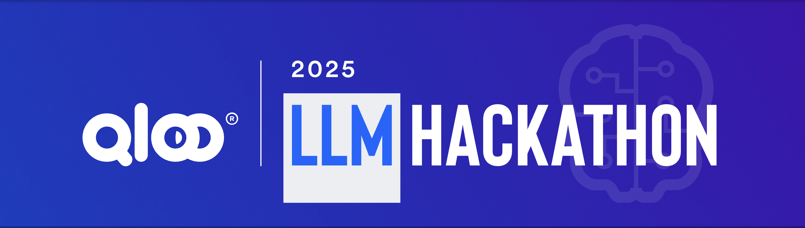
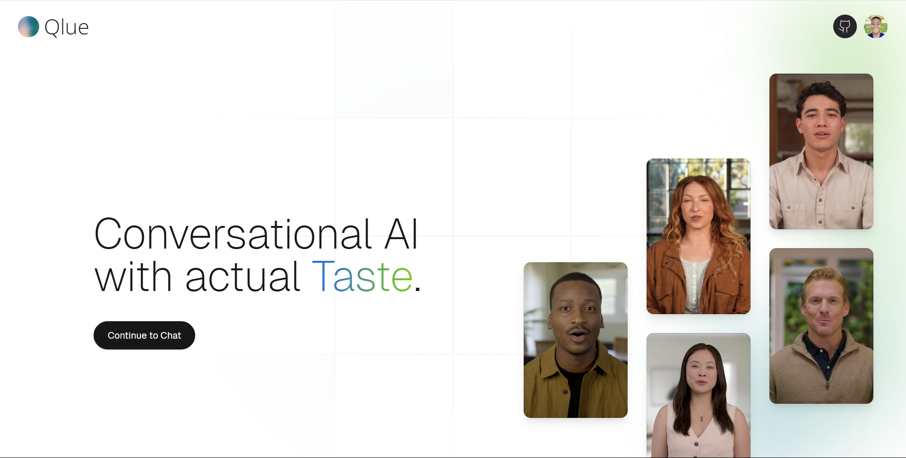

<p align="center">
  
</p>

<h1 align="center">Qlue</h1>

<p align="center">
  <em>Artificial Intelligence with Actual Taste</em>
</p>

<p align="center">
  
  
  
  
  
  
</p>

<h2 align="center">Powered By</h2>
<br/>
<p align="center">
  
  &nbsp;&nbsp;&nbsp;&nbsp;&nbsp;&nbsp;&nbsp;&nbsp;
</p>

<p align="center ">
  
</p>

Qlue is a revolutionary AI experience powered by an intelligent agent that dynamically builds comprehensive taste profiles in real-time. Unlike static AI systems, Qlue's agent actively discovers, analyzes, and connects your preferences across domains, feeding this rich intelligence to personalized video agents (Tavus) for conversations that feel genuinely human and deeply personal.

## ✨ Key Differentiators

- **Agent-Powered Taste Discovery:** Unlike static profiling systems, Qlue employs an intelligent agent that treats taste discovery as an active investigation. The agent leverages Qloo's cultural intelligence API as its toolkit to dynamically investigate, discover, and connect preferences across domains.

- **Cross-Domain Intelligence:** Qlue's agent connects preferences across all life domains - music → food → lifestyle → psychology. It discovers hidden connections like "Taylor Swift fans typically enjoy artisanal coffee" and "Korean BBQ suggests adventurous spirit."

- **Real-Time WebSocket Profile Building:** Utilizes WebSocket connections to stream profile discoveries in real-time, creating an engaging experience where users see their taste profile being built live with confidence scoring and reasoning chains.

- **Hybrid Agentic Architecture:** Implements a controlled agentic workflow that allows for strategic AI reasoning in key parts while maintaining better context handling and reliability than fully autonomous systems.

- **Pattern-Matched Cross-Domain Profiling:** Instead of using all signals across all domains, Qlue implements intelligent pattern matching that yields more relevant results (podcasts → books, TV shows → podcasts, movies → books, books → movies/TV shows).

- **Custom TypeScript SDK:** Developed a comprehensive, type-safe TypeScript SDK for the Qloo API to streamline development and ensure robust API integration with full IntelliSense support.

## 🏗️ Architecture

- **Frontend:** React (Vite) with TanStack Router & Query, TypeScript

  - **Real-time Updates:** WebSocket connections for streaming profile discoveries
  - **Video Integration:** Tavus video agents for personalized conversations
  - **UI Components:** Custom CVI components for enhanced user experience

- **Backend:** Bun with HonoJs, TypeScript

  - **Agent System:** Intelligent taste discovery agent with Qloo API integration
  - **Database:** PostgreSQL with Prisma ORM for data persistence
  - **WebSocket:** Real-time communication for live profile updates
  - **AI Integration:** Vercel AI SDK for structured outputs and streaming

- **AI Services:**
  - **Qloo API:** Cultural intelligence and taste-based insights
  - **Tavus:** Personalized video agent conversations
  - **Vercel AI SDK:** AI SDK documentation for enhanced agent capabilities
  - **Open AI :** OPEN AI Models (Gpt 4.1)

## 🔧 Custom TypeScript SDK Development

> [!IMPORTANT]
> As part of the Qloo Hackathon 2025, we developed a comprehensive TypeScript SDK to efficiently interact with the Qloo API. This SDK provides type safety, developer-friendly interfaces, and streamlined API integration.

### SDK Features

- **Type-Safe API Integration:** Full TypeScript support with comprehensive type definitions for all Qloo API endpoints
- **Developer-Friendly Design:** Intuitive API design with excellent IDE support and IntelliSense
- **Dual Module Support:** Works with both ESM and CommonJS environments
- **Built-in Validation:** Request/response validation using Zod schemas
- **Modern JavaScript Support:** Compatible with Node.js 18+ and modern runtimes
- **Comprehensive Documentation:** Complete documentation and usage examples

### SDK Repository

The custom TypeScript SDK is available at: [qloo-ts-sdk](https://github.com/manasseh-zw/qloo-ts-sdk)

This SDK was developed to address the complexity of the Qloo API and provide a more efficient, type-safe way to interact with cultural intelligence endpoints. It includes:

- Complete API coverage for Insights, Audiences, and Tags endpoints
- Type-safe request/response handling
- Built-in error handling and validation
- Support for multiple server environments (hackathon, staging, production)
- Comprehensive examples and documentation

## 🔄 Taste Discovery Flow

1. **User Input & Initial Analysis:**

   - User provides preferences (e.g., "I love Taylor Swift, Joe Rogan, and Korean BBQ")
   - Agent analyzes input and creates investigation strategy
   - System initializes real-time WebSocket session

2. **Cross-Domain Investigation:**

   - Agent makes strategic Qloo API calls using the custom SDK to discover taste patterns
   - Implements signal weighting to maintain domain relevance
   - Discovers hidden connections across music, food, lifestyle, and psychology
   - Streams discoveries in real-time to user interface via WebSocket

3. **Pattern Recognition & Profile Building:**

   - Agent identifies psychological patterns and personality traits
   - Builds comprehensive taste profile with confidence scoring
   - Implements pattern-matched cross-domain profiling for relevant results
   - Continuously adapts strategy based on discoveries

4. **Video Agent Integration:**

   - Rich contextual data feeds to Tavus video agents
   - Personalized conversations with deep understanding
   - Real-time adaptation based on evolving profile
   - Authentic interactions that feel genuinely human

## 💡 Challenges & Design Decisions

> [!NOTE]
> These innovative design decisions highlight Qlue's interesting architecture and our approach to solving complex technical challenges.

- **Custom TypeScript SDK Development:** To efficiently interact with the Qloo API, we developed a comprehensive TypeScript SDK from the OpenAPI specification. This SDK provides type safety, developer-friendly interfaces, and streamlined API integration, making it significantly easier to build intelligent agent calls and handle complex cultural intelligence queries.

- **Cross-Domain Signal Weighting:** Discovered that cross-domain searches were getting diluted by unrelated signals. Solved by implementing dynamic signal weighting (`signal.entities.weight`) to ensure domain-specific entities maintained relevance.

- **Pattern-Matched Profiling:** Instead of using all signals across all domains, we implemented intelligent pattern matching that yields more relevant results. For example, podcast preferences → book recommendations, TV shows → podcast suggestions.

- **Hybrid Agentic Architecture:** Initially went fully agentic with LLM tool calls but pivoted to a hybrid approach that allows for more controlled workflows while implementing AI reasoning in key parts. This proved better for context handling and reliability.

- **Real-Time WebSocket Communication:** Implemented WebSocket connections to stream profile discoveries in real-time, creating an engaging experience where users see their taste profile being built live with confidence scoring and reasoning chains.

## 🚀 Getting Started

> [!TIP]
> Follow these steps to quickly set up Qlue on your local environment for development or testing purposes.

### Prerequisites

- Bun (recommended) or npm
- PostgreSQL database
- Qloo API key
- Tavus API credentials

### Installation

1. **Clone the repository:**

   ```bash
   git clone https://github.com/manasseh-zw/qlue.git
   cd qlue
   ```

2. **Install dependencies:**

   ```bash
   # Install client dependencies
   cd qlue.client
   bun install

   # Install server dependencies
   cd ../qlue.server
   bun install
   ```

3. **Environment Setup:**

   ```bash
   # Copy environment files
   cp .env.example .env

   # Configure your environment variables
   QLOO_API_KEY=your_qloo_api_key
   TAVUS_API_KEY=your_tavus_api_key
   DATABASE_URL=your_postgresql_url
   ```

4. **Database Setup:**

   ```bash
   cd qlue.server
   bun run prisma generate
   bun run prisma db push
   ```

5. **Start Development Servers:**

   ```bash
   # Start the server
   cd qlue.server
   bun run dev

   # Start the client (in another terminal)
   cd qlue.client
   bun run dev
   ```

## ☁️ Deployment

> [!NOTE]
> Qlue can be deployed to cloud environments for production use. The following steps outline the deployment process for both backend and frontend components.

### Backend Deployment

- **Platform:** Deploy to Vercel, Railway, or Render
- **Database:** Use managed PostgreSQL service (Supabase, Neon, etc.)
- **Environment:** Set up production environment variables
- **Build:** `bun run build` for production build

### Frontend Deployment

- **Platform:** Deploy to Vercel, Netlify, or similar
- **Build:** `bun run build` generates static assets
- **Configuration:** Update API endpoints for production

## 🔍 Solution Architecture Benefits

> [!TIP]
> The architectural benefits below demonstrate why Qlue is an enterprise-ready solution with superior maintainability, scalability, and integration capabilities.

- **Modular Design:** Qlue's architecture separates concerns (taste discovery, profile building, video integration) into discrete components, allowing for easy maintenance and extensibility. When we wanted to add support for new taste domains, we only needed to modify the agent's investigation pipeline without disrupting other components.

- **Scalability:** The asynchronous event-driven design using WebSockets enables Qlue to handle multiple user sessions simultaneously without performance degradation. The system maintains responsiveness while processing complex taste discovery queries.

- **Integration Flexibility:** The system integrates seamlessly with Qloo's cultural intelligence API through our custom TypeScript SDK while maintaining the ability to incorporate specialized tools like Tavus for video agents. This hybrid approach leverages the strengths of cultural intelligence while accessing specialized capabilities when needed.

- **Real-Time Intelligence:** The WebSocket architecture provides immediate feedback to users, creating engaging experiences where they can see their taste profile being built in real-time with confidence scoring and reasoning chains.

- **Type-Safe Development:** The custom TypeScript SDK ensures robust API integration with full type safety, reducing development time and preventing runtime errors.

## 🎯 Use Cases

### For Users

- **Authentic AI:** Conversations that feel genuinely understanding
- **Discovery Engine:** Find content/experiences you didn't know you'd love
- **Self-Knowledge:** Learn about yourself through taste pattern analysis
- **Evolving Relationships:** AI that grows more insightful over time

### For Businesses

- **Marketing Agencies:** Agents build detailed consumer personas automatically
- **E-commerce:** Dynamic product recommendations with reasoning
- **Content Platforms:** Taste-aware content curation and discovery
- **Dating Apps:** Deep compatibility matching beyond superficial preferences

## 🔗 Links

<div align="center">
  <a href="https://github.com/manasseh-zw/qlue">
    
  </a>&nbsp;&nbsp;
  
  <a href="https://github.com/manasseh-zw/qloo-ts-sdk">
    
  </a>&nbsp;&nbsp;
  
  <a href="https://www.linkedin.com/in/devmanasseh/">
    
  </a>&nbsp;&nbsp;
  
  <a href="https://x.com/devmanasseh">
    
  </a>
</div>

<div align="center">
  <br>
  <a href="https://qloo.com/">
    
  </a>
</div>

---

<p align="center">
  <em>Qlue ~ Artificial Intelligence with Actual Taste</em>
</p>

<br>

## 📚 References

> [!NOTE]
> Qlue's architecture is built upon cutting-edge research and techniques in AI, cultural intelligence, and agentic systems. The following references were instrumental in developing Qlue's sophisticated capabilities.

- **Cultural Intelligence**: [Qloo API Documentation](https://qloo.com/) - The foundation for Qlue's taste discovery capabilities, enabling cross-domain cultural analysis and preference mapping.

- **Custom TypeScript SDK**: [Qloo TypeScript SDK](https://github.com/manasseh-zw/qloo-ts-sdk) - Our custom-developed SDK that provides type-safe, developer-friendly access to the Qloo API, streamlining integration and ensuring robust cultural intelligence queries.

- **Agentic Systems**: [Vercel AI SDK Guide](https://sdk.vercel.ai/) - Leveraged for structured outputs and streaming capabilities that power Qlue's real-time profile building.

- **Video AI Integration**: [Tavus Documentation](https://tavus.com/) - Enables personalized video agent conversations that feel genuinely human and deeply personal.

- **Cross-Domain Analysis**: [Cultural Intelligence Research](https://mf.media.mit.edu/pubs/journal/TasteFabric.pdf) - Theoretical foundation for connecting preferences across music, food, lifestyle, and psychology domains.

These advanced techniques were carefully integrated into Qlue's agentic architecture to create an AI experience that surpasses traditional personalization approaches. The custom TypeScript SDK enhances development efficiency and type safety, while the WebSocket architecture enables engaging real-time experiences that feel genuinely understanding.
